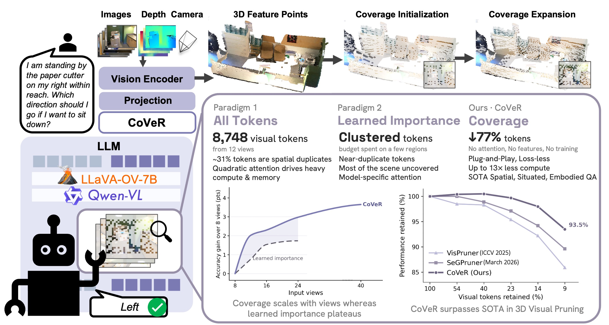

<div align="center">

# CoVeR: Coverage-Based Token Pruning for Multi-View <br> 3D Reasoning in VLMs
<div>
  <a href="https://tanbuinhat.github.io/">Nhat-Tan Bui*</a><sup>1</sup>&emsp;
  <a href="https://varshini-e.github.io/">Varshini Elangovan*</a><sup>1</sup>&emsp;
  <a href="https://www.linkedin.com/in/a-arun-reddy/">Arun Reddy Anugu</a><sup>1</sup>&emsp;
  <a href="https://sreyas-mohan.github.io/">Sreyas Mohan</a><sup>2</sup>&emsp;
  <a href="https://ywwwer.github.io/">Wei Ye</a><sup>2</sup>&emsp;
  <a href="https://wdilin.github.io/">Dilin Wang</a><sup>2</sup><br class="author-break">
  <a href="https://www.linkedin.com/in/jq-huang/">JQ Huang</a><sup>2</sup>&emsp;
  <a href="https://www.linkedin.com/in/rakesh-r-3848538/">Rakesh Ranjan</a><sup>2</sup>&emsp;
  <a href="https://aviralchharia.github.io/">Aviral Chharia</a><sup>1,&dagger;</sup>&emsp;
  <a href="https://www.cs.cmu.edu/~ftorre/">Fernando De la Torre</a><sup>1</sup>
</div>
<div>
    <sup><b>1</b></sup> Carnegie Mellon University&emsp; <sup><b>2</b></sup> Meta Reality Labs<br>
</div>
<div>
    <b>arXiv 2026</b>
</div>
<br>

  <a href="https://humansensinglab.github.io/CoVeR/"></a>
  [](https://arxiv.org/abs/2609.08345)  [](https://github.com/humansensinglab/CoVeR)

---



Achieve 93.5% of full-token performance with just 8% of the tokens! We present CoVeR - a deterministic, training-free token pruner for multi-view inputs to 2D VLMs that selects a subset of visual tokens collectively covering the scene. 
</div>

---

## :rocket: **Updates**
- ✅ **Coming Soon**: Full CoVeR Codebase. Stay Tuned!
- ✅ **Sep. 8, 2026**: We released the CoVeR on [arXiv](https://arxiv.org/abs/2609.08345). Check the preprint!

## :open_book: **Abstract**

Representing a 3D scene as multi-view images allows 2D VLMs to reason in 3D by reusing priors from pre-training, sidestepping the scarcity of annotated 3D data. However, it produces thousands of redundant visual tokens whose cost grows with every view. Existing visual token pruners fall into two families, each limited in the 3D multi-view setting. Learned importance methods rank tokens by attention or encoder features; because redundancy here is fundamentally spatial, they keep near-duplicate tokens from a few prominent regions and leave most of the scene unrepresented. Voxelization methods improve spatial coverage but cannot enforce an exact token budget and saturate as multi-view observations overlap in 3D, capping retention well below the target. We show that spatial coverage is associated with 3D reasoning performance and introduce CoVeR, a deterministic, training-free selector that uses only token coordinates, with no learned signals. CoVeR selects tokens that collectively cover every region of the scene, and solves the limitations of both families: it enforces an exact per-scene budget, breaks the voxelization saturation plateau, and avoids the near-duplicate selections of learned importance. Extensive experiments show CoVeR outperforms prior SOTAs on all three 3D reasoning benchmarks and generalizes as a plug-and-play module tested across four VLMs. Notably, with only ≈8% of visual tokens, it preserves 93.5% of full-token performance, surpassing SOTA by 3.9 percentage points on average across benchmarks.

## Star History

[](https://www.star-history.com/#humansensinglab/CoVeR&Date)

## :bookmark_tabs: Citation
If you find our work useful for your project, please consider adding a star to this repo and citing our paper:
```bibtex
    @misc{bui2026covercoveragebasedtokenpruning,
      title={CoVeR: Coverage-Based Token Pruning for Multi-View 3D Reasoning in VLMs}, 
      author={Nhat-Tan Bui and Varshini Elangovan and Arun Reddy Anugu and Sreyas Mohan and Wei Ye and Dilin Wang and JQ Huang and Rakesh Ranjan and Aviral Chharia and Fernando De la Torre},
      year={2026},
      eprint={2609.08345},
      archivePrefix={arXiv},
      primaryClass={cs.CV},
      url={https://arxiv.org/abs/2609.08345}, 
  }
```
